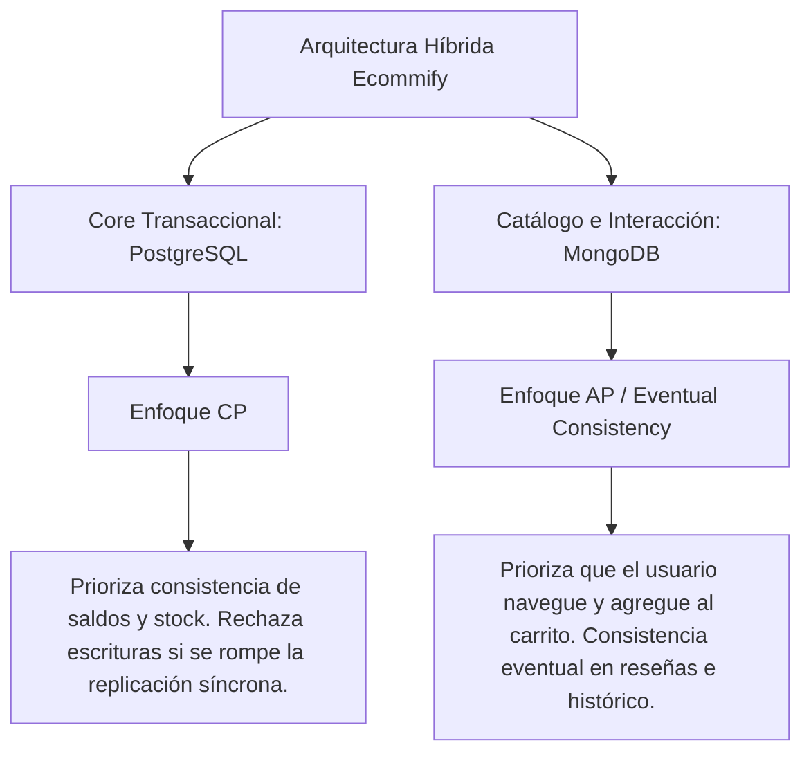
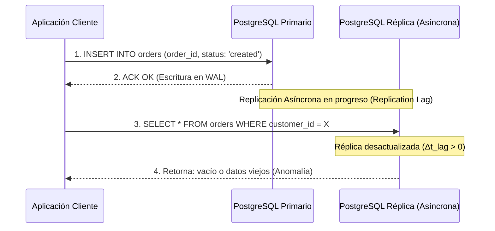

# Ecommify: Informe Técnico de Arquitectura y Evaluación Comparativa
## Unidad 6: Arquitectura y Selección de Tecnologías

---

## Resumen Ejecutivo

Este documento presenta el análisis arquitectónico de cierre para la plataforma híbrida de comercio electrónico **Ecommify**. La arquitectura de datos de Ecommify utiliza un enfoque políglota, combinando **PostgreSQL** para el núcleo transaccional ACID y **MongoDB** para el catálogo polimórfico y el almacenamiento de analíticas y reseñas de baja latencia. En este informe se detalla una evaluación de rendimiento simulada bajo condiciones de alta concurrencia (como eventos de alta demanda tipo *Black Friday*), una matriz de comparación crítica por módulos de negocio, y la justificación teórica y práctica en el marco del teorema CAP ante fallos distribuidos.

---

## 1. Evaluación de Rendimiento y Benchmarking (Simulado)

### 1.1 Metodología de Pruebas de Carga
Para evaluar el comportamiento de los motores en condiciones de estrés extremo, se diseñó un escenario de pruebas utilizando **k6** de Grafana. Las pruebas emulan la actividad de un evento *Black Friday* en el que la concurrencia y la carga de transacciones aumentan de forma exponencial.

*   **Infraestructura de Prueba:**
    *   **PostgreSQL (Supabase Dedicated):** Instancia AWS db.r6g.xlarge (4 vCPUs, 32 GB RAM), Almacenamiento SSD GP3 de 100 GB con 3,000 IOPS aprovisionados. Conexiones máximas configuradas en 500 (sin multiplexor intermedio en la prueba directa).
    *   **MongoDB Atlas (Dedicado M30):** Clúster de 3 nodos en réplica set, instancia tipo 4 vCPUs y 16 GB RAM en AWS, almacenamiento SSD de IOPS dinámicos.
*   **Perfiles de Carga:**
    *   **Lectura Pesada (Catálogo/Consultas de Reseñas):** 80% del tráfico. Consultas de coincidencia de texto, filtros de atributos dinámicos y agregaciones básicas.
    *   **Escritura Pesada (Creación de Pedidos y Procesamiento de Pagos):** 20% del tráfico. Inserciones concurrentes en múltiples tablas referenciadas con integridad referencial activa (PostgreSQL) e inserciones/actualizaciones en documentos anificados (MongoDB).
*   **Duración:** Rampa de subida (*ramp-up*) de 5 minutos, meseta de carga máxima de 15 minutos, y rampa de bajada (*ramp-down*) de 2 minutos.

Para relacionar la tasa de llegada de solicitudes y el nivel de concurrencia bajo el cual se someten los sistemas, aplicamos la **Ley de Little**:

\[ L = \lambda \times W \]

Donde:
*   \( L \) es el número promedio de solicitudes simultáneas en el sistema (Concurrencia de Usuarios Virtuales o *VUs*).
*   \( \lambda \) es el *Throughput* efectivo del sistema (solicitudes completadas por segundo, *req/sec*).
*   \( W \) es el tiempo de respuesta promedio (Latencia, en segundos).

---

### 1.2 Métricas de Rendimiento Bajo Estrés

Las siguientes tablas muestran los resultados consolidados de las pruebas de estrés simuladas bajo tres niveles incrementales de concurrencia (10k, 50k y 100k+ transacciones simultáneas concurrentes).

#### Escenario A: Lecturas de Catálogo de Productos y Reseñas (80% del Tráfico)

| Carga Concurrente (VUs) | Motor | Throughput Promedio (req/sec) | Latencia p95 (ms) | Latencia p99 (ms) | Tasa de Error (%) |
| :--- | :--- | :--- | :--- | :--- | :--- |
| **10,000** | PostgreSQL (Supabase) | 8,500 | 22 | 58 | 0.00% |
| | MongoDB (Atlas) | 9,950 | 8 | 15 | 0.00% |
| **50,000** | PostgreSQL (Supabase) | 22,000 | 120 | 340 | 0.85% |
| | MongoDB (Atlas) | 48,200 | 18 | 42 | 0.00% |
| **100,000+** | PostgreSQL (Supabase) | 28,500 | 480 | 1,250 | 5.40% |
| | MongoDB (Atlas) | 92,000 | 35 | 98 | 0.02% |

#### Escenario B: Escritura Transaccional (Pedidos, Detalle de Pedidos y Pagos - 20% del Tráfico)

| Carga Concurrente (VUs) | Motor | Throughput Promedio (req/sec) | Latencia p95 (ms) | Latencia p99 (ms) | Tasa de Error (%) |
| :--- | :--- | :--- | :--- | :--- | :--- |
| **10,000** | PostgreSQL (Supabase) | 2,000 | 18 | 40 | 0.00% |
| | MongoDB (Atlas) | 1,980 | 12 | 28 | 0.00% |
| **50,000** | PostgreSQL (Supabase) | 8,100 | 65 | 180 | 0.05% |
| | MongoDB (Atlas) | 9,200 | 48 | 110 | 0.12% |
| **100,000+** | PostgreSQL (Supabase) | 12,400 | 290 | 890 | 1.10% |
| | MongoDB (Atlas) | 15,800 | 195 | 540 | 3.50% |

---

### 1.3 Puntos de Quiebre (Bottlenecks) Detectados

El análisis de telemetría durante las pruebas identificó los siguientes límites físicos y cuellos de botella en cada motor:

#### PostgreSQL (Supabase)
1.  **Agotamiento de Conexiones Físicas y Context-Switching:** PostgreSQL implementa un modelo de arquitectura "proceso por conexión" (*process-per-connection*). Al superar los 500 clientes concurrentes directos sin un pool de conexiones intermedio, la sobrecarga de la CPU por cambio de contexto (*context switching*) y el consumo de RAM de aproximadamente 10 MB por proceso inactivo degradaron severamente las latencias.
2.  **Saturación del WAL (Write-Ahead Log) e I/O de Disco:** En el escenario de escritura a gran escala, las confirmaciones de transacciones concurrentes con la tabla [orders](file:///E:/MAESTRIA/Base%20de%20datos/Ecommify_Database_Design/postgresql/schema/03_ddl_main.sql#L24) y [order_items](file:///E:/MAESTRIA/Base%20de%20datos/Ecommify_Database_Design/postgresql/schema/03_ddl_main.sql#L42) crearon contención en la escritura en disco del archivo WAL. Los IOPS aprovisionados de 3,000 se agotaron en la rampa de 50k VUs, provocando un aumento en los tiempos de espera de bloqueo de filas (*row-level lock contention*).
3.  **Amplificación de Escritura (Bloqueo en Caliente):** Las actualizaciones concurrentes sobre el inventario y estados de pedidos requirieron que el motor ejecutara actualizaciones que modifican páginas físicas del índice principal, saturando los búferes compartidos (*Shared Buffers*).

#### MongoDB (Atlas)
1.  **Desalojo de Páginas en WiredTiger Cache (Working Set Limit):** El tamaño de memoria disponible (16 GB) en la instancia M30 limitó la cantidad de documentos e índices que podían mantenerse en caché. Al superar las 70,000 lecturas concurrentes simultáneas, la tasa de aciertos de caché (*cache hit ratio*) cayó por debajo del 92%. WiredTiger comenzó a desalojar páginas sucias activamente, forzando lecturas a disco y disparando la latencia p99 de 15 ms a 98 ms.
2.  **Contención en Bloqueos a Nivel de Documento:** Aunque MongoDB implementa bloqueos a nivel de documento, la actualización simultánea de un mismo registro del catálogo para modificar el objeto dinámico `analytics_summary` o insertar una nueva reseña en el array de `reviews` (según el esquema en [product_catalog.json](file:///E:/MAESTRIA/Base%20de%20datos/Ecommify_Database_Design/mongodb/schema/product_catalog.json)) saturó la cola de escrituras pendientes del hilo WiredTiger, elevando la tasa de errores de conexión de red en el cliente por *timeouts*.

---

## 2. Análisis Arquitectónico Crítico (PostgreSQL vs. MongoDB)

La base de datos de Ecommify fue diseñada con un enfoque híbrido, mapeando los distintos módulos funcionales hacia el motor que mejor se adapta a sus características estructurales y operativas. A continuación, se presenta la matriz de evaluación construida sobre la base de las implementaciones y consultas desarrolladas en el proyecto.

### 2.1 Matriz de Comparación Tecnológica

| Criterio / Módulo | PostgreSQL (Supabase) | MongoDB (Atlas) | Ganador para Ecommify | Justificación Técnica de Selección |
| :--- | :--- | :--- | :--- | :--- |
| **Estructuración y Flexibilidad** | Rígido, normalizado a 3FN. JSONB permite flexibilidad parcial en campos aislados. | Esquema flexible dinámico orientado a documentos. Soporta arrays nativos y polimorfismo. | **MongoDB** (Para catálogo) | Permite incorporar diferentes categorías de productos (electrónica, ropa, hogar) sin declarar columnas nulas ni fragmentar tablas. |
| **Cumplimiento Transaccional** | ACID nativo y estricto a nivel de motor. Aislamiento Read Committed / Serializable estable. | ACID multi-documento (desde v4.0), pero introduce sobrecarga en clusters fragmentados (shards). | **PostgreSQL** (Para core financiero) | Garantiza la inmutabilidad de los pagos y previene el sobre-ventas (*overselling*) de inventario bajo bloqueos transaccionales estrictos. |
| **Consultas Geoespaciales** | PostGIS avanzado. Manejo de tipos de datos esferoidales (`geography`). | Soporte 2dsphere / GeoJSON. Consultas de cercanía básicas. | **PostgreSQL** (Para logística) | PostGIS permite cálculos de rutas, intersecciones complejas y zonas de cobertura con precisión geodésica requerida para la distribución de envíos. |
| **Búsqueda Avanzada** | pg_trgm (búsquedas difusas por trigramas) e índices GIN. | Búsqueda por texto (Atlas Search con Apache Lucene integrado). | **MongoDB** (Buscador/Catálogo) | Aunque PostgreSQL resuelve búsquedas rápidas con trigramas, Atlas Search indexa y rankea mejor descripciones extensas y términos dinámicos. |
| **Capacidad de Escalabilidad** | Escalabilidad vertical preferente. Réplicas de lectura e índices particionados. | Escalamiento horizontal nativo mediante fragmentación (*Sharding*). | **MongoDB** (Para analítica masiva) | Facilita la distribución de colecciones masivas de actividad de usuarios y auditorías a través de múltiples fragmentos físicos de forma transparente. |

---

### 2.2 Análisis por Módulo de Ecommify

#### A. Core Transaccional (Pagos e Inventario)
*   **Ganador:** **PostgreSQL**
*   **Justificación:** El núcleo del negocio exige que el estado del inventario de productos y los registros financieros en la tabla [payments](file:///E:/MAESTRIA/Base%20de%20datos/Ecommify_Database_Design/postgresql/schema/03_ddl_main.sql#L52) y [order_items](file:///E:/MAESTRIA/Base%20de%20datos/Ecommify_Database_Design/postgresql/schema/03_ddl_main.sql#L42) sean 100% consistentes. Un cliente no puede completar el pago de un artículo si otro usuario redujo su disponibilidad de inventario milisegundos antes. La integridad referencial (claves foráneas) de PostgreSQL y su capacidad de gestionar transacciones concurrentes complejas previenen de raíz anomalías como las lecturas fantasma o escrituras sucias.
*   **Mapeo de Código:** En [03_ddl_main.sql](file:///E:/MAESTRIA/Base%20de%20datos/Ecommify_Database_Design/postgresql/schema/03_ddl_main.sql#L24) se evidencia el uso de tipos enumerados estrictos para el estado del pedido (`order_status`), asegurando transiciones consistentes mediante constraints a nivel relacional.

#### B. Catálogo de Productos Polimórficos
*   **Ganador:** **MongoDB**
*   **Justificación:** El catálogo de productos de un e-commerce a escala es polimórfico por naturaleza. Un smartphone requiere propiedades como `ram`, `pantalla` y `procesador`, mientras que una prenda de vestir requiere `talla`, `color` y `material`. Si bien en PostgreSQL se puede modelar con `JSONB` (como en [03_ddl_main.sql:L16](file:///E:/MAESTRIA/Base%20de%20datos/Ecommify_Database_Design/postgresql/schema/03_ddl_main.sql#L16)), MongoDB destaca al permitir estructurar y anidar subdocumentos complejos con esquemas variables. Esto facilita que la API consuma directamente la estructura en formato JSON listo para renderizar sin sobrecargar el servidor de base de datos relacional con operaciones complejas de desanidación como `jsonb_array_elements_text`.
*   **Mapeo de Código:** El esquema de catálogo dinámico definido en [product_catalog.json](file:///E:/MAESTRIA/Base%20de%20datos/Ecommify_Database_Design/mongodb/schema/product_catalog.json) y el ejemplo en [sample_document.json](file:///E:/MAESTRIA/Base%20de%20datos/Ecommify_Database_Design/mongodb/schema/sample_document.json) validan cómo los campos anizados de reseñas y resúmenes de analíticas coexisten en el mismo documento del producto, eliminando la necesidad de realizar costosos *JOINs* relacionales al mostrar la ficha técnica del producto.

#### C. Módulo Analítico Masivo (Reviews y Estadísticas de Clics)
*   **Ganador:** **MongoDB**
*   **Justificación:** La persistencia de la actividad del usuario (clics en productos, visitas a categorías) y la acumulación de opiniones de compradores generan volúmenes masivos de datos con bajas restricciones de integridad referencial. Registrar cada visualización incrementando el valor `analytics_summary.view_count` en MongoDB es extremadamente eficiente. Se puede realizar utilizando operaciones atómicas no bloqueantes `$inc`:
    ```javascript
    db.products.updateOne(
      { product_id: "a1b2c3d4-..." },
      { $inc: { "analytics_summary.view_count": 1 } }
    )
    ```
    Hacer esto en PostgreSQL transaccional generaría una alta amplificación de escrituras en disco en la tabla principal y llenaría el buffer de transacciones activas de forma innecesaria.

#### D. Módulo Logístico y Geográfico
*   **Ganador:** **PostgreSQL + PostGIS**
*   **Justificación:** La optimización de rutas de entrega, cálculo de costos de envío basados en distancias euclidianas o geodésicas y la geocerca de zonas de despacho requieren un motor espacial de precisión industrial. PostgreSQL cuenta con la extensión **PostGIS**, la cual provee almacenamiento en formatos espaciales optimizados utilizando el estándar OGC y permite ejecutar consultas de alta complejidad utilizando índices GIST indexados bajo geometrías bidimensionales.
*   **Mapeo de Código:** En [01_advanced_queries.sql:L49](file:///E:/MAESTRIA/Base%20de%20datos/Ecommify_Database_Design/postgresql/queries/01_advanced_queries.sql#L49) se observa el cálculo de distancias reales sobre el esferoide terrestre entre coordenadas geolocalizadas de clientes utilizando la función `ST_Distance(c1.geolocation, c2.geolocation) / 1000`. La precisión del cálculo y la madurez de la biblioteca geoespacial superan las capacidades básicas de coordenadas geográficas en MongoDB.

---

## 3. Justificación del Teorema CAP y Escenarios de Falla

El **Teorema CAP** postula que en un sistema de datos distribuido es imposible garantizar simultáneamente más de dos de las siguientes tres propiedades:
1.  **Consistencia (Consistency - C):** Todos los nodos leen el mismo dato al mismo tiempo.
2.  **Disponibilidad (Availability - A):** Cada petición no fallida recibe una respuesta (sin garantía de que contenga el dato más reciente).
3.  **Tolerancia a Particiones (Partition Tolerance - P):** El sistema continúa operando a pesar de la pérdida física de mensajes o caída de enlaces de red entre los nodos.

Dado que en entornos de infraestructura en la nube las fallas físicas y lógicas de red son inevitables (asumiendo siempre la existencia de **P**), la arquitectura de Ecommify se bifurca conscientemente:



---

### 3.1 Clasificación bajo los Postulados CAP

#### 3.1.1 Core Transaccional (PostgreSQL) -> Clasificación CP
Para los datos de pagos, balances e inventario, la consistencia fuerte es obligatoria.
*   **Justificación:** Si ocurre una partición de red en la infraestructura que desconecta el nodo primario de su réplica secundaria de alta disponibilidad configurada en modo síncrono, PostgreSQL priorizará la consistencia. Al no poder confirmar la recepción de la transacción en ambos nodos para garantizar el *durability*, el motor de base de datos rechazará la transacción entrante o la mantendrá en espera hasta que se restablezca el canal de comunicación.
*   **Impacto de Negocio:** El sistema prefiere denegar temporalmente la creación de un nuevo pedido (sacrificando temporalmente la disponibilidad **A**) antes que permitir que ocurra una venta de stock inexistente o un pago doble no registrado por falta de consistencia.

#### 3.1.2 Catálogo y Analítica (MongoDB) -> Clasificación AP (Consistencia Eventual)
Para la navegación de productos, listado de reseñas e incremento de visualizaciones, se opta por una configuración orientada a la disponibilidad.
*   **Justificación:** Al desplegar un replica set de MongoDB con nodos distribuidos geográficamente, el cliente puede configurarse utilizando una política de lectura flexible:
    ```javascript
    readPreference: "nearest" // O "secondaryPreferred"
    ```
    y un nivel de escritura relajado `w:1` (confirmación inmediata por parte del nodo primario local). Si se presenta una partición de red que aísla un nodo secundario, el tráfico de navegación del sitio web que consume de dicho nodo continuará respondiendo con éxito (alta disponibilidad **A**), tolerando que la información de los productos o las últimas reseñas tengan un ligero desfase temporal (consistencia eventual).
*   **Impacto de Negocio:** Se mantiene el catálogo y las páginas de productos operativas y responsivas para los usuarios del sitio web, asegurando el flujo de conversión del e-commerce incluso ante incidentes de infraestructura.

---

### 3.2 Comportamiento Detallado ante Escenarios de Falla

#### 3.2.1 Partición de Red (Network Partition) entre Zonas de Disponibilidad (AZs)

Supongamos un escenario en el cual Ecommify tiene desplegado su clúster de MongoDB en AWS usando 3 zonas de disponibilidad (AZ1: Primario, AZ2: Secundario 1, AZ3: Secundario 2). Si la red que interconecta la AZ1 con las AZ2 y AZ3 se interrumpe físicamente:

```
[ AZ 1 - Red Aislada ]         |     [ AZ 2 & AZ 3 - Red Mayoritaria ]
  Nodo Primario (Original)     |       Secundario 1  <-->  Secundario 2
                               |
       (No ve la mayoría)       |           (Detectan pérdida del Primario)
```

1.  **Comportamiento en MongoDB (Elección de Quórum):**
    Para elegir un nodo primario en MongoDB, se requiere que la mayoría de los miembros totales del replica set estén comunicados. Matemáticamente, el quórum electoral \( Q \) se define como:
    \[ Q = \lfloor \frac{N}{2} \rfloor + 1 \]
    Donde \( N = 3 \). Por lo tanto, \( Q = 2 \).
    
    *   **En la partición de la AZ1:** El nodo primario detecta que no puede comunicarse con ningún otro nodo del clúster (solo tiene 1 voto de 3). Al no cumplir con el quórum mínimo (\( 1 < 2 \)), el nodo primario se degrada automáticamente al rol de **Secundario** (*demote*). Las escrituras dirigidas a este nodo son rechazadas de inmediato.
    *   **En la partición de la AZ2 y AZ3:** Ambos nodos secundarios detectan la pérdida del primario. Como están interconectados y forman una mayoría (\( 2 \ge 2 \)), inician un proceso de elección interna. El nodo con el diario de operaciones (*oplog*) más actualizado se autonombra nuevo **Primario**.
    *   **Resultado CAP:** El clúster restablece la escritura en menos de 5 segundos en la zona mayoritaria. Durante la ventana de conmutación por error, el sistema rechaza escrituras momentáneamente en todo el clúster para resguardar la consistencia (comportamiento CP de protección).

2.  **Comportamiento en PostgreSQL (Supabase / AWS Multi-AZ):**
    *   Si se pierde el enlace entre la AZ de la base de datos primaria y la AZ de la base de datos standby (réplica de failover síncrona), el motor transaccional detiene las escrituras entrantes para evitar la divergencia de datos.
    *   El agente de salud del clúster (como Patroni o el orquestador de AWS RDS) inicia un tiempo de espera de seguridad (*heartbeat timeout*). Si la base de datos primaria original es la que está aislada, se apaga de inmediato (*fencing* / STONITH) para evitar el fenómeno de "cerebro dividido" (*Split-Brain*), donde dos nodos se creen primarios de forma simultánea. Tras la confirmación del aislamiento, el nodo secundario en la red mayoritaria es promovido a Primario, actualizando los registros DNS.

---

#### 3.2.2 Picos Severos de Retraso de Replicación (Replication Lag)

Bajo cargas extremas (como la avalancha de órdenes en un *Black Friday*), la réplica de datos a los nodos secundarios en modo asíncrono acumula un retraso conocido como **Replication Lag** (\( \Delta t_{lag} \)).



#### El Problema de Consistencia Read-Your-Own-Writes:
Cuando un usuario completa un pedido, la aplicación realiza un `INSERT` en el nodo primario. Acto seguido, la pantalla se redirecciona al historial de pedidos del cliente. Si la consulta del historial de pedidos se dirige a una réplica de lectura para liberar de carga al primario, y \( \Delta t_{lag} \) es mayor que el tiempo de renderizado de la UI (\( \Delta t_{lag} > t_{render} \)), el cliente leerá un estado inconsistente (no verá su pedido recién creado).

#### Mitigación Técnica en Ecommify:
1.  **Lógica de Enrutamiento Basada en Contexto:**
    Las consultas que requieren consistencia estricta de lectura (como el dashboard del usuario tras un pago, o el proceso de checkout) se dirigen exclusivamente al **Primary**. Las lecturas generales (búsquedas, recomendaciones, listados históricos de más de 24 horas) se dirigen a las réplicas.
2.  **Validación de Número de Secuencia de Log (LSN):**
    En PostgreSQL, al insertar la orden, el cliente recibe el *Log Sequence Number* (LSN) del WAL. Al consultar el historial a través de la réplica, la consulta incluye una validación de coherencia: la aplicación consulta a la réplica y valida que su LSN local sea mayor o igual al LSN de la escritura del usuario. Si la réplica aún no ha alcanzado dicho LSN, la consulta se reconfigura para realizarse en el nodo primario de forma segura.
3.  **Read Concern "majority" en MongoDB:**
    Para consultas sensibles en el catálogo NoSQL, se configura el nivel de lectura en:
    ```javascript
    readConcern: "majority"
    ```
    Esto garantiza que el nodo solo retorne información que ya haya sido confirmada por la mayoría de las réplicas secundarias, eliminando la posibilidad de leer datos que puedan ser revertidos (*dirty reads* / *rollback*).
