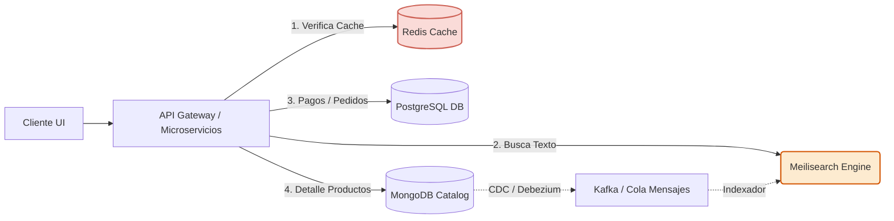

# Ecommify: Plan de Escalamiento a Producción y Recomendaciones Estratégicas
## Unidad 6: Proyección Tecnológica 10x

---

## Resumen Ejecutivo

Este documento define la hoja de ruta técnica y económica para escalar la plataforma de comercio electrónico **Ecommify** a un volumen transaccional 10 veces mayor (10x) al actual. El plan incluye estrategias de escalamiento vertical y horizontal de bases de datos, un plan detallado de migración con tiempo de inactividad cero (*Zero-Downtime Migration*), estimaciones de costos operativos, integraciones de CI/CD para la automatización del esquema de datos, e incorporación de componentes complementarios de caché, búsquedas avanzadas y observabilidad corporativa.

---

## 1. Estrategia de Escalamiento 10x

Para soportar un incremento de 10 veces la carga transaccional actual (proyectando pasar de 1,000 transacciones/sec de lectura/escritura combinadas a un pico sostenido de **10,000 transacciones/sec**), se estructuró la siguiente estrategia híbrida:

### 1.1 Escalamiento Vertical (Scale-up) de Capacidad Base

El escalamiento vertical aumenta la potencia de procesamiento de las instancias de bases de datos principales para asegurar que el conjunto de datos activo (*Working Set*) se mantenga en memoria RAM y se minimice la latencia física de I/O de disco.

#### PostgreSQL (Capa Transaccional)
*   **Instancia Objetivo:** AWS RDS `db.r6g.16xlarge` (64 vCPUs, 512 GB RAM) o nodo equivalente en Supabase Enterprise.
*   **Almacenamiento:** Volúmenes SSD EBS `io2 Block Express` con **40,000 IOPS provisionados** y tasa de transferencia de rendimiento de 1,000 MB/s. Esto evita cuellos de botella en la escritura del WAL (Write-Ahead Log) durante picos masivos de facturación.
*   **Configuración de Memoria:**
    *   `shared_buffers`: Configurado a 128 GB (25% de la RAM total) para maximizar la tasa de aciertos de páginas de índices y tablas calientes en memoria.
    *   `work_mem`: 128 MB por operación de ordenamiento/hash para evitar que consultas de agregación escriban en disco temporalmente.

#### MongoDB (Capa de Catálogo e Interacción NoSQL)
*   **Instancia Objetivo:** MongoDB Atlas Clase `M200` (64 vCPUs, 512 GB RAM, réplica set de 3 nodos).
*   **Almacenamiento:** Discos de estado sólido NVMe locales con tasa de transferencia superior a 2.5 GB/s y latencias sub-milisegundo.
*   **Configuración de Cache WiredTiger:** Configurada al 60% de la memoria física (~300 GB) para almacenar el catálogo completo de productos dinámicos y el historial activo de opiniones de clientes en RAM.

---

### 1.2 Escalamiento Horizontal (Scale-out)

El escalamiento horizontal permite distribuir la carga de trabajo entre múltiples nodos físicos y particionar las bases de datos para evitar límites estructurales de hardware.

```mermaid
graph TD
    Client[Aplicación Cliente / API] --> Router[Capa de Aplicación / Enrutador]
    
    subgraph PostgreSQL Cluster (Consistencia / Finanzas)
        Router -->|Escrituras / Checkouts| PG_Pri[PostgreSQL Primario]
        Router -->|Lecturas / Reportes| PGB[PgBouncer Connection Pooler]
        PGB --> PGR1[Read Replica 1]
        PGB --> PGR2[Read Replica 2]
        PGB --> PGR3[Read Replica 3]
        PG_Pri -.->|Replicación Asíncrona WAL| PGR1
        PG_Pri -.->|Replicación Asíncrona WAL| PGR2
        PG_Pri -.->|Replicación Asíncrona WAL| PGR3
    end
    
    subgraph MongoDB Cluster (Catálogo / Analítica)
        Router -->|Consultas de Catálogo / Reseñas| Mongos[Mongos Query Router]
        Mongos --> ShardA[Shard A - Replica Set]
        Mongos --> ShardB[Shard B - Replica Set]
        Mongos --> ShardC[Shard C - Replica Set]
    end
    
    style PG_Pri fill:#d5f5e3,stroke:#27ae60,stroke-width:2px
    style Mongos fill:#ebdef0,stroke:#8e44ad,stroke-width:2px
```

#### 1.2.1 PostgreSQL: PgBouncer, Réplicas de Lectura y Particionamiento

1.  **Connection Pooling con PgBouncer:**
    A diferencia de PostgreSQL que asigna un proceso de sistema operativo por conexión activa (consumiendo ~10MB por conexión y generando contención de CPU), implementamos **PgBouncer** configurado en modo **Transaction Pooling** (*agrupación a nivel de transacción*). Esto permite que 15,000 conexiones activas de la capa de API de microservicios sean multiplexadas y servidas por un pool de solo 300 conexiones físicas reales en la base de datos primaria, reduciendo el consumo inútil de recursos de CPU y RAM.
2.  **Réplicas de Lectura Geodistribuidas:**
    Se configuran **3 réplicas de lectura asíncronas**. El tráfico de consultas analíticas pesadas, búsquedas históricas y perfiles de usuario se redirige a estas réplicas mediante enrutamiento de consultas en el ORM (ej. Prisma Read Replicas), manteniendo la base de datos primaria dedicada exclusivamente a inserciones y actualizaciones de órdenes de pago.
3.  **Particionamiento de Tablas:**
    Como se implementó en el archivo [03_ddl_main.sql:L23](file:///E:/MAESTRIA/Base%20de%20datos/Ecommify_Database_Design/postgresql/schema/03_ddl_main.sql#L23), la tabla `orders` y sus dependencias están particionadas por rango en la columna `purchase_timestamp`. Esto permite realizar un descarte automático de particiones (*Partition Pruning*) en las consultas de pedidos. La base de datos solo escanea el archivo físico de la partición activa del trimestre en curso (ej. `orders_2023_q4`), manteniendo los índices pequeños y rápidos de recorrer en memoria.

#### 1.2.2 MongoDB: Sharding (Fragmentación Horizontal) del Catálogo

Para escalar horizontalmente la colección de productos y reseñas NoSQL, implementamos **MongoDB Sharding**:

*   **Selección de la Shard Key (Clave de Fragmentación):**
    Evaluamos dos alternativas para fragmentar la colección del catálogo enriched:
    1.  `{ category_path: 1, product_id: 1 }` (Clave Compuesta por Rango): Excelente para consultas de navegación por categorías (Breadcrumbs), ya que localiza los datos de una misma categoría en el mismo shard. Sin embargo, puede crear un "Hot Shard" (punto caliente de escritura) si una categoría específica recibe picos extremos de ventas o tráfico de reseñas en un momento dado.
    2.  `{ product_id: "hashed" }` (Clave basada en Hash de UUID): Distribuye de manera perfectamente uniforme las escrituras y lecturas de productos en todos los shards disponibles en el clúster. Las consultas de navegación requieren una operación de difusión (*scatter-gather*), pero elimina completamente el riesgo de saturación de un único nodo físico.
*   **Selección Final:** Se opta por `{ product_id: "hashed" }` debido a la alta tasa de actualización de reseñas y resúmenes analíticos concurrentes por producto individual bajo la carga 10x. El balanceador automático de MongoDB distribuye los fragmentos entre 3 Shards físicos separados.

---

## 2. Plan de Migración Económico y Técnico (Producción Real)

### 2.1 Presupuesto Mensual de Infraestructura Proyectada

A continuación, se estiman los costos teóricos de alojar el clúster híbrido escalado en AWS y MongoDB Atlas Enterprise, en contraste con los niveles iniciales de desarrollo.

| Concepto / Servicio | Configuración Inicial (Desarrollo) | Configuración Escalada (Producción 10x) | Costo Mensual Estimado (USD) |
| :--- | :--- | :--- | :--- |
| **PostgreSQL / Supabase** | Nivel Gratis (Free Tier: 500MB, CPU compartido) | Supabase Enterprise (Instancia Dedicada `db.r6g.xlarge` Multi-AZ, 4 vCPUs, 32GB RAM, 100GB SSD GP3 3K IOPS) | \$350.00 / mes |
| **MongoDB Atlas** | Clúster Compartido `M0` (512MB RAM, CPU compartido) | Clúster Dedicado `M30` (3 Nodos en Replica Set, 4 vCPUs, 16GB RAM, Auto-scaling de almacenamiento) | \$220.00 / mes |
| **Caché (Redis)** | No implementado | Redis Enterprise Cloud (Instancia de 10GB en memoria, replicación HA en AWS) | \$70.00 / mes |
| **Buscador (Meilisearch)**| Búsqueda nativa SQL en base relacional | AWS EC2 Dedicado (1 Instancia `t3.medium` para Meilisearch, 4GB RAM) | \$40.00 / mes |
| **Observabilidad** | Consola Supabase/Atlas básica | Datadog Core + Logs Integration / DB Monitoring | \$120.00 / mes |
| **Total Operativo Proyectado** | **\$0.00 / mes** | | **\$800.00 / mes** |

---

### 2.2 Estrategia de Migración con Tiempo de Inactividad Cero (Zero-Downtime)

La transición desde los entornos gratuitos compartidos hacia los clústeres empresariales debe realizarse sin interrumpir el flujo de ventas.

```
Fase 1: Configurar Origen (wal_level = logical)
Fase 2: Instanciar Destino y cargar DDL
Fase 3: CDC e inicio de sincronización inicial
Fase 4: Réplica activa (Lag ~ 0s)
Fase 5: Cutover (Cambio de cadenas de conexión y DNS)
```

#### Paso 1: Migración de PostgreSQL (Mediante AWS DMS o pglogical)
1.  **Configuración de Origen:**
    Modificar la configuración del servidor de origen (`postgresql.conf`) para habilitar la replicación lógica:
    ```ini
    wal_level = logical
    max_replication_slots = 5
    max_wal_senders = 5
    ```
2.  **Extracción de Esquema y Datos Iniciales:**
    Ejecutar un volcado inicial solo de las estructuras DDL (esquema, tipos personalizados e índices) desde el servidor origen al servidor de producción destino utilizando `pg_dump` con la opción `--schema-only`. Los scripts ejecutados se corresponden con [01_extensions.sql](file:///E:/MAESTRIA/Base%20de%20datos/Ecommify_Database_Design/postgresql/schema/01_extensions.sql), [02_types.sql](file:///E:/MAESTRIA/Base%20de%20datos/Ecommify_Database_Design/postgresql/schema/02_types.sql), [03_ddl_main.sql](file:///E:/MAESTRIA/Base%20de%20datos/Ecommify_Database_Design/postgresql/schema/03_ddl_main.sql) y [04_triggers.sql](file:///E:/MAESTRIA/Base%20de%20datos/Ecommify_Database_Design/postgresql/schema/04_triggers.sql).
3.  **Configuración del Canal de Sincronización:**
    Crear una suscripción de replicación lógica nativa de PostgreSQL:
    *   *En el Origen:* `CREATE PUBLICATION pub_ecommify FOR ALL TABLES;`
    *   *En el Destino:* `CREATE SUBSCRIPTION sub_ecommify CONNECTION 'host=origen_ip dbname=ecommify user=rep_user password=xxx' PUBLICATION pub_ecommify;`
4.  **Monitoreo y Transición (Cutover):**
    El motor de destino descargará los datos históricos de las tablas y, una vez completado el volcado inicial, entrará en modo de replicación de cambios en vivo leyendo el WAL en streaming. Monitorear el retraso de replicación usando:
    ```sql
    SELECT pg_size_pretty(pg_wal_lsn_diff(pg_current_wal_lsn(), write_lsn)) AS replication_lag
    FROM pg_stat_replication;
    ```
    Cuando el retraso de replicación sea menor a 1 segundo:
    *   Colocar la aplicación web origen temporalmente en modo de "Solo Lectura" (lectura de catálogo activa, desactivar checkout por un lapso estimado de 5 segundos).
    *   Esperar a que el retraso en la base de datos destino caiga a 0.
    *   Actualizar las variables de entorno de producción de la API para apuntar a la nueva IP/DNS del PostgreSQL dedicado.
    *   Restablecer el modo Lectura-Escritura.

#### Paso 2: Migración de MongoDB (Mediante Atlas Live Migration)
1.  **Habilitación de Oplog en Origen:**
    Asegurar que el MongoDB de desarrollo esté configurado como replica set para generar el registro de operaciones `oplog.rs`.
2.  **Servicio de Migración en Vivo (Atlas Live Migration):**
    *   En el panel de MongoDB Atlas, iniciar el asistente de *Live Migration*.
    *   Proporcionar la cadena de conexión del MongoDB origen y permitir el acceso de red a las direcciones IP públicas del clúster de Atlas.
    *   Atlas se unirá lógicamente al flujo del oplog del origen, replicando inicialmente la colección y aplicando secuencialmente los cambios que ocurran en caliente.
3.  **Corte Controlado:**
    Cuando el panel de Atlas indique que el estado de sincronización está actualizado, presione el botón de conmutación de corte (*Start Cutover*). Atlas detendrá temporalmente la recepción de modificaciones del origen y esperará a que el cliente actualice la cadena de conexión de su aplicación con la URI del nuevo clúster de producción (ej. `mongodb+srv://...`). El proceso completo se completa en segundos y sin pérdida de datos.

---

## 3. Estrategia de CI/CD para Datos y Herramientas Complementarias

### 3.1 Flujo Automatizado de Integración y Despliegue de Datos

La aplicación de cambios de esquema en entornos de producción con alta concurrencia requiere la eliminación de intervenciones manuales y la garantía de retrocompatibilidad.

```
[ Desarrollador ] -> Crea PR en GitHub con script SQL de Migración
      |
      v
[ GitHub Actions Pipeline (CI) ]
      |-- 1. Levanta contenedor efímero de Postgres en Docker
      |-- 2. Ejecuta la migración contra el contenedor de prueba
      |-- 3. Corre pruebas de integración (Verifica que no rompa el código)
      |
      v (Merge a la rama main)
[ Deployment Pipeline (CD) ]
      |-- 4. Ejecuta Liquibase / Prisma Migrate contra DB Staging
      |-- 5. Ejecuta Liquibase / Prisma Migrate contra DB Producción
```

#### Procedimiento de Control de Migraciones en GitHub Actions:
*   **Herramienta Propuesta:** **Prisma Migrations** (o **Liquibase** para control corporativo multi-esquema).
*   **Estrategia Expand-and-Contract (Expandir y Contraer):**
    Para evitar caídas del servicio al modificar campos transaccionales activos, prohibimos altercados directos como renombrar columnas de forma destructiva. En su lugar, las migraciones se dividen en tres releases de software:
    1.  **Expandir (Fase 1):** Se introduce la nueva columna con valor nulo permitido (ej. agregar `payment_token` en la tabla [payments](file:///E:/MAESTRIA/Base%20de%20datos/Ecommify_Database_Design/postgresql/schema/03_ddl_main.sql#L53)). La aplicación se despliega para escribir datos simultáneamente en la columna vieja y la columna nueva, manteniendo la lectura en la vieja.
    2.  **Migrar (Fase 2):** Se ejecuta un script en segundo plano que procesa los datos existentes de forma controlada por bloques (*batching*) para actualizar los registros antiguos a la nueva columna.
    3.  **Contraer (Fase 3):** Se actualiza el código de la aplicación para leer exclusivamente de la nueva columna. Una vez estable, se lanza una última migración SQL para eliminar la columna obsoleta de forma segura.

---

### 3.2 Componentes Tecnológicos Complementarios del Ecosistema

Para descargar de trabajo a las bases de datos primarias de Ecommify, se propone e integra la siguiente arquitectura de servicios auxiliares:



#### 3.2.1 Memoria Caché con Redis
*   **Propósito:** Reducir en un 70% las lecturas repetitivas al catálogo de MongoDB y de sesiones en PostgreSQL.
*   **Caso de Uso en Ecommify:**
    *   **Caché de Catálogo:** Almacenamiento de las fichas de productos más buscadas o promociones activas (cuyo rango temporal se evalúa en [01_advanced_queries.sql:L43](file:///E:/MAESTRIA/Base%20de%20datos/Ecommify_Database_Design/postgresql/queries/01_advanced_queries.sql#L43)).
    *   **Estrategia de Evicción:** Implementación del algoritmo *Least Recently Used* (LRU) con un tiempo de vida (TTL) de 1 hora.
    *   **Patrón de Acceso:** *Cache-Aside*. Si los datos no están en Redis, la API los consulta a MongoDB y los almacena en Redis para posteriores consultas. Ante una actualización en el catálogo, un trigger o evento en la API invalida la llave correspondiente de Redis de inmediato.

#### 3.2.2 Motor de Búsqueda Avanzada con Meilisearch o Elasticsearch
*   **Propósito:** Ofrecer un motor de búsqueda de texto completo rápido, tolerante a errores ortográficos y con filtros dinámicos instantáneos (facets).
*   **Justificación:** Aunque PostgreSQL posee capacidad de búsqueda con trigramas (usando `pg_trgm` y el operador `%` en [01_advanced_queries.sql:L69](file:///E:/MAESTRIA/Base%20de%20datos/Ecommify_Database_Design/postgresql/queries/01_advanced_queries.sql#L69)), estas búsquedas consumen alta capacidad de procesamiento de CPU en cargas de nivel 10x.
*   **Implementación:** Configurar **Meilisearch** por su ligereza y facilidad de integración. Sincronizar el catálogo de MongoDB con Meilisearch en tiempo real mediante un conector Change Data Capture (CDC) como **Debezium** acoplado a un bus de mensajería (Kafka), o mediante publicación de eventos en la capa de aplicación al editar productos.

#### 3.2.3 Plataforma de Observabilidad con Prometheus y Grafana (o Datadog)
*   **Propósito:** Monitorear de forma holística la salud del hardware, red y lógica de las bases de datos de Ecommify.
*   **Métricas Clave a Monitorear:**
    *   **PostgreSQL:** Tasa de aciertos en búfer (`shared_buffers_hit_ratio`), cantidad de conexiones físicas activas vs conexiones en PgBouncer, latencia de escrituras WAL, porcentaje de uso de IOPS de almacenamiento, y consultas lentas registradas por el módulo `pg_stat_statements`.
    *   **MongoDB:** Latencia promedio de lectura/escritura WiredTiger, tasa de fallos de página de caché (*cache page evictions*), número de elecciones de primario en el Replica Set, y porcentaje de utilización de CPU por agregaciones complejas.
    *   **Alertas Críticas:** Alertas automáticas enviadas a través de PagerDuty/Slack si el uso de CPU de PostgreSQL supera el 85% durante 5 minutos, o si el retraso de replicación de las réplicas transaccionales supera los 5 segundos.
